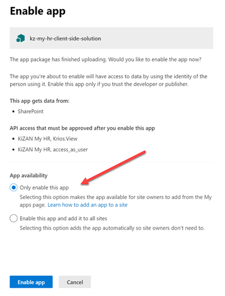
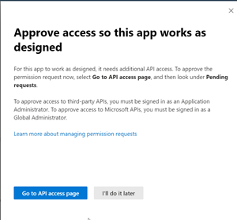
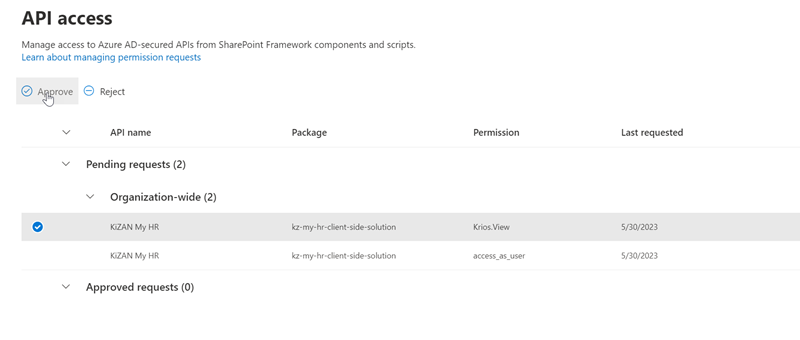

# Installing Krios Viva Connections Card

Prerequisites:

* You have executed the steps to subscribe to Krios and to upload organization data to Krios. If you have not completed this process, you may deploy Krios, but it will only display sample data to users
* You must should be a SharePoint Online Administrator in your tenant
* You have previously configured the App Catalog in your SharePoint Online Tenant. If you have not, follow the process to do so at [Overview of apps in SharePoint
](https://learn.microsoft.com/en-us/sharepoint/request-app-installation-permissions)
* You are enabled as an App Approver in your App Catalog (if configured)
* You have deployed Viva Connections to your enviornment, including making at least one SharePoint Online Home Site. If you have not, follow the process to do so at: [Set up and Launch Viva Connections](https://learn.microsoft.com/en-us/viva/connections/viva-connections-setup-guide)

## Upload the Package to App Catalog

1. Download the latest Krios SPFX Package from [Krios-Samples](https://www.github.com/kizantech/krios-samples/)
2. Navigate to your SharePoint Online App Catalog by navigating to "More Features"... "Apps"
3. Select "Upload" and upload the Krios .sppkg file for Krios
4. When prompted, ensure that you select "Only enable this app", as we don't want to deploy Krios to every site

5. After being enabled (this may take 2-3 minutes), you will be prompted to grant the Krios API access so that it may read users' profiles (so we can pass Krios the current user from the context of Viva Connections) and to query the Krios API as the user. 

6. Click "Go to API access page", or you can resume this step later by selecting "API Access" on the left navigation of your App Catalog.
7. Once loaded, you should see 2, Organization-wide, Pending requests for Krios. Select each request, review and approve.

## Add Krios to Viva Connections Dashboard

1. Navigate to your Viva Connections Dashboard Page
2. Add the Krios Adaptive Card to the Dashboard. We recommend targeting it to a group of Pilot users while confirming that it is working as expected.
3. You can also add multiple Krios cards to your Dashboard, perhaps targeting different experience (or languages) at different groups of individuals in your organization. For example, Interns may only see the Birthday and Next Payroll information, while full time salaried employees get the full Krios experience.

## What's Next?

Check out the Krios "User Guide" for the configuration options Krios offers to customize it to your unique requirements. 